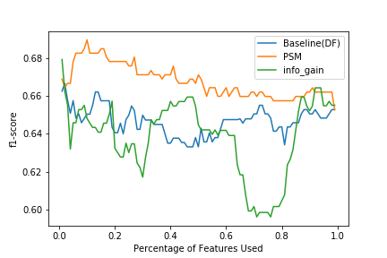
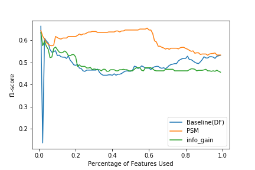

# FakeNews Detection with Propensity Score Matching

This is a repository for _Improving Generalizability of Fake News Detection Methods using Propensity Score Matching_

## Repository Structure

Our implementation of Propensity Score Matching in text feature extraction is under the folder models. Specific application could be found in the notebook _Training and Evaluation.ipynb_. 

## Illustrations
* Model trained on features of gossip cop but evaluated on politifact.

* Model trained on features of politifact but evaluated on gossipcop

## Author
Bo Ni - _initial commit_ - bni@nd.edu
