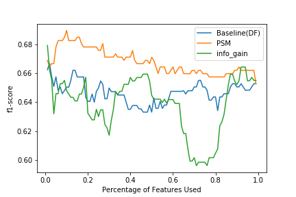
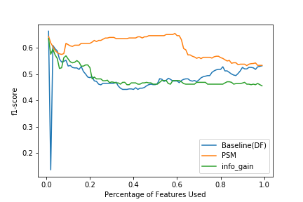

# FakeNews Detection with Propensity Score Matching

This is a repository for [Improving Generalizability of Fake News Detection Methods using Propensity Score Matching](https://arxiv.org/abs/2002.00838)

## Repository Structure

Our implementation of Propensity Score Matching in text feature extraction is under the folder models. Specific application could be found in the notebook _Training and Evaluation.ipynb_. 

## Instructions
Clone the folder _models_ to your own directory. Then import the propensity score module from it (Besides Propensity Score, I also included infomation gain for experimental purposes; feel free to use it :) ).
```
from models.propensity_score import propensity_score, info_gain
```
Then you can simply create an instance and fit your data, such as this:

```
p_score_gossipcop = propensity_score()
p_score_gossipcop.fit(gossipcop)
```

The acceptable input will be something like the following 
```
Texts  |  Label
```


## Illustrations
* Model trained on features of gossip cop but evaluated on politifact.

* Model trained on features of politifact but evaluated on gossipcop


## Author
Bo Ni - _initial commit_ - bni@nd.edu
